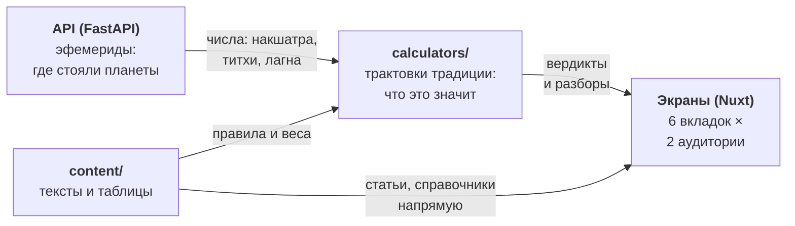
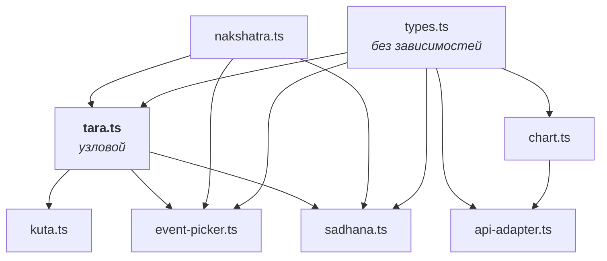
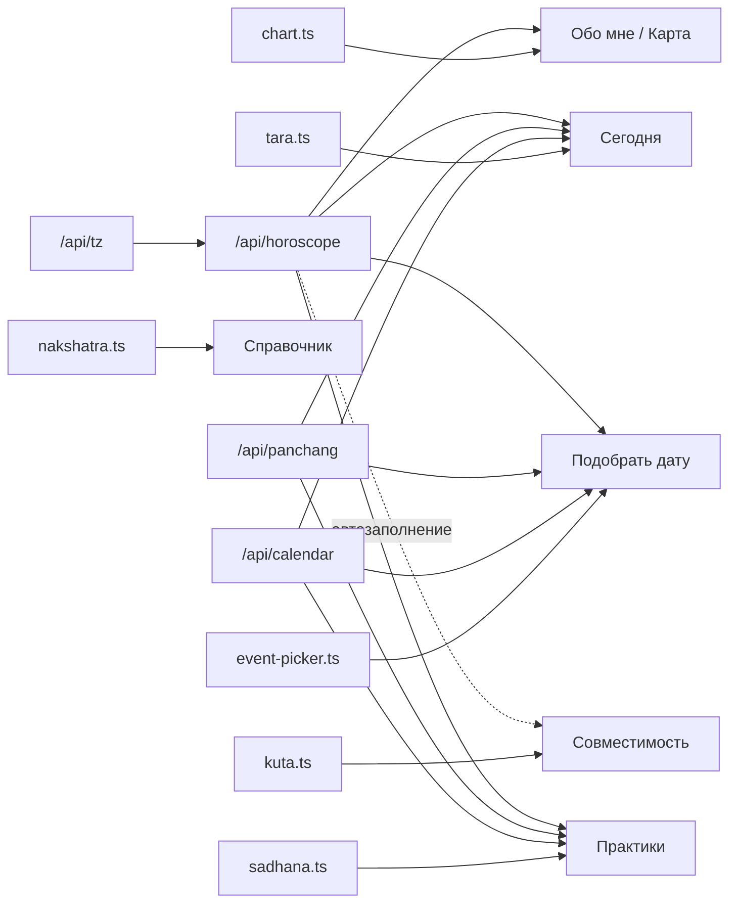
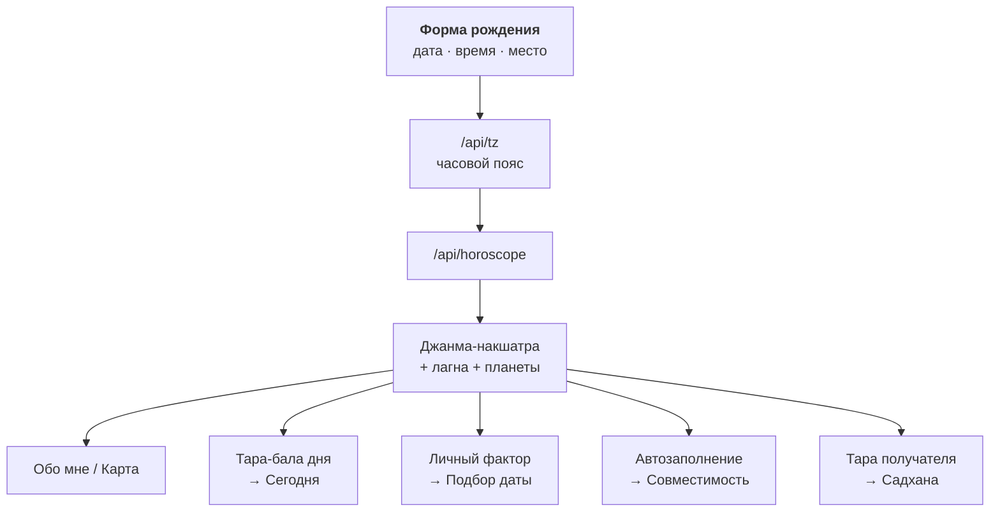
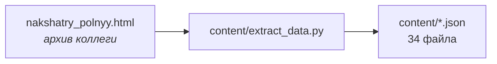

# Карта зависимостей

Что от чего зависит: от API и данных до экранов. Построено по фактическим импортам
в `calculators/*.ts` и карте экранов из [`SERVICE-IA.md`](SERVICE-IA.md).
Статусы — из [`COVERAGE.md`](COVERAGE.md).

Обозначения: 🟢 работает · 🟡 калькулятор готов, данные не подключены · 🔴 не задействовано

---

## 1. Четыре слоя

Ключевое: **данные питают UI двумя путями** — через калькулятор (когда нужен расчёт)
и напрямую (когда нужен просто текст). Второй путь не требует ни API, ни расчётов —
поэтому «Справочник» можно строить хоть завтра, независимо от всего остального.

---

## 2. Внутренние зависимости калькуляторов

**Что это значит на практике:**

| Тронешь | Заденет |
|---|---|
| `nakshatra.ts` | tara → и следом kuta, event-picker, sadhana (**почти всё**) |
| `tara.ts` | kuta, event-picker, sadhana (3 калькулятора) |
| `types.ts` | все, но это только типы — правки безопасны |
| `chart.ts` | api-adapter |
| `kuta.ts`, `sadhana.ts`, `event-picker.ts` | никого — листья, менять безопасно |

Порядок разбора при отладке: сломалась тара → смотри `nakshatra.ts`;
сломался подбор даты → сначала `tara.ts`, потом веса.

**Самые критичные узлы** (от скольких других зависят, посчитано по графу):

| Узел | Зависят | Почему |
|---|---|---|
| `types.ts` | 11 | общие типы, но правки безопасны — только типы |
| `nakshatra_names`, `nak_rulers_seq`, `nak_ruler_short`, `gandanta_padas` | 11 | питают `nakshatra.ts` — фундамент всего |
| `nakshatra.ts` | 10 | ярлыки и управители нужны почти каждому калькулятору |
| `tara.ts` | 7 | три калькулятора + четыре экрана |

Правило: правки в `nakshatra.ts` и его четырёх JSON требуют проверки всех
калькуляторов; правки в `kuta.ts` / `sadhana.ts` / `event-picker.ts` — локальны.

> Мелочь для точности: `api-adapter.ts` импортирует из `chart.ts` только **тип**
> (`ChartPlanetInput`). На рантайм это не влияет, но при удалении `chart.ts`
> адаптер перестанет компилироваться.

---

## 3. Что нужно для каждого экрана

Важно: **калькуляторы не ходят в API**. Они чистые функции — данные из API в них
передаёт экран. Поэтому стрелки идут «API → экран», а не «API → калькулятор».

### Сложность экранов (посчитано по графу)

| Экран | Узлов нужно | API | Комментарий |
|---|---|---|---|
| **Справочник** | 20 | **не нужен** | можно строить хоть сейчас, независимо ни от чего |
| **Совместимость** | 16 | horoscope (опц.) | самый простой с расчётом; работает и на ручном вводе |
| **Практики** | 20 | все 4 | садхана требует дат, мантры — нет |
| **Подобрать дату** | 21 | все 4 | |
| **Обо мне / Карта** | 23 | tz + horoscope | не нужны панчанга и календарь |
| **Сегодня** | 26 | все 4 | самый связанный экран |

### Детально по экранам

| Экран | API | Калькуляторы | Данные | Статус |
|---|---|---|---|---|
| **Обо мне / Карта** | `/tz` → `/horoscope` | chart, nakshatra | nakshatras, placements, houses, signs · 🔴 chart_geometry, padas, yogakarma, planet_in_nakshatra, retrograde | 🟡 |
| **Сегодня** | `/panchang`, `/calendar` | tara | tara_bala · 🔴 panchanga, tithi, muhurta30, tara_school, tara_dana | 🟡 |
| **Подобрать дату** | `/calendar`, `/panchang` | event-picker → tara, nakshatra | events_muhurta (7 из 33), tithi, picker_weights | 🟡 |
| **Совместимость** | `/horoscope` ×2 (опц.) | kuta → tara | nakshatras | 🟢 |
| **Практики** | `/calendar`, `/panchang` (садхана) | sadhana → tara, nakshatra | sadhana, mantra_upaya, planet_stories | 🟢 |
| **Справочник** | **не нужен** | nakshatra (ярлыки) | nakshatras, glossary, padas, signs, houses · 🔴 filter_defs, planet_in_nakshatra, sources | 🟢 |

Сквозные для всех экранов: `disclaimers`, `ui_texts`, `design_tokens`, `ui_colors` (🔴 не подключены).

---

## 4. Цепочка разблокировки

Почему форма рождения — первая задача: от неё зависит почти всё персональное.

Пока формы нет, все эти экраны работают на демо-данных или требуют ручного ввода
накшатры. Один шаг закрывает пять зависимостей.

**Что НЕ зависит от формы** (можно делать параллельно):
Справочник целиком, общая панчанга дня (без личной тары), совместимость по
ручному вводу двух накшатр, мантры и истории планет.

---

## 5. Зависимости данных от источника

Весь `content/` восстановим из исходного HTML-архива:

Если архив обновится — данные пересобираются скриптом, ручных правок в JSON быть
не должно (иначе они потеряются при пересборке).

Исключение: `disclaimers.json` и `ui_texts.json` дособирались отдельно —
при пересборке их надо переносить руками.
